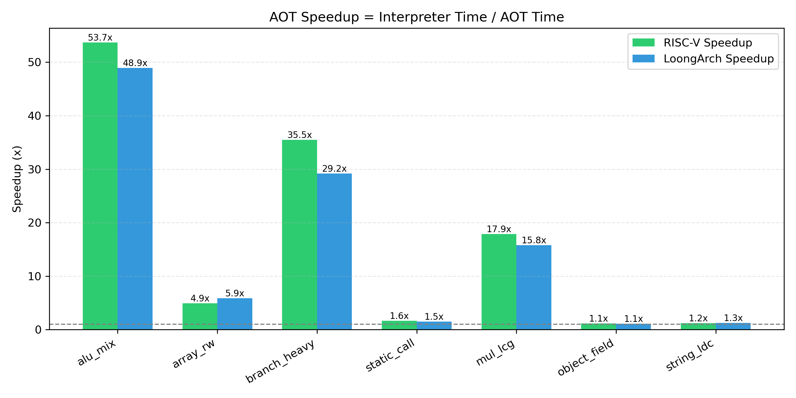
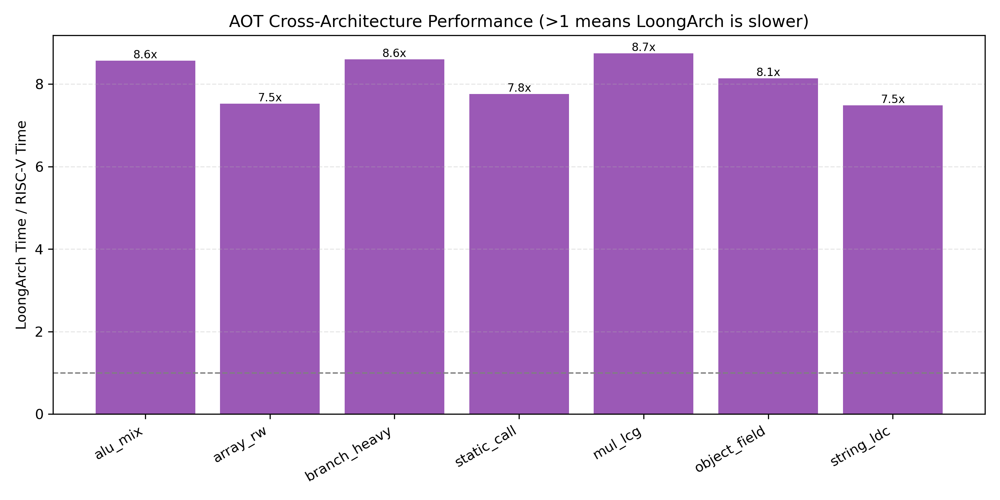

# RmikuJVM

一个支持装载期 AOT 编译的最小化 JVM，运行在自己写的操作系统 RmikuOS 上（支持 RISC-V 和 LoongArch64 双架构）。

> **一句话**：整数运算比解释器快 50 倍，双架构后端，不依赖任何宿主操作系统直接跑 Java 字节码。

---

## 功能

- **Class 文件解析器**：完整支持常量池、方法表、字段表、异常表
- **栈机解释器**：约 80 条指令（iadd、imul、goto、invokestatic、invokevirtual、new、数组、ldc、athrow 等）
- **Mark-Sweep GC**：单核 STW，自适应触发阈值
- **装载期 AOT**：类加载时把字节码翻译成宿主机器码（无 JIT 预热，热点方法无需回退解释器）
- **双架构后端**：RISC-V RV64GC 和 LoongArch64 共用同一套翻译器，仅代码生成函数不同
- **本地方法桥接**：Java `native` 方法通过分发表直接映射到系统调用（print、文件 IO、exit）
- **裸机友好数据结构**：手写 Treap 替代 std::map，极简 FILE 封装，不依赖 STL

---

## 架构

```
Java 源码 (.java)
       |
   javac（宿主机编译）
       v
  字节码 (.class)
       |
  +------------------+
  |  类加载器         |  <-- 解析常量池，解析符号引用
  +------------------+
       |
  +------------------+
  |  AOT 翻译器       |  <-- 字节码 → RISC-V / LoongArch 机器码
  +------------------+
       |
  +------------------+
  |  机器码           |  <-- mprotect 改 RX 权限，直接跳转执行
  +------------------+
       |
   RmikuOS 系统调用
```

---

## 快速开始

### 标准库版（Linux/macOS/Windows，用于开发和调试）

```bash
make

./jvm Main.class
```

标准库版使用 `std::vector`、`std::map`、`std::string`、`fopen`/`fread` 等标准 API，不依赖任何裸机代码，方便在宿主机上验证 JVM 逻辑正确性。

### RmikuOS 裸机版（RISC-V / LoongArch64）

```bash
# 1. 宿主机编译 Java 测试程序
python3 user/build.py riscv64        # 或 loongarch64

# 2. 打包进 ext4 根文件系统
./mkfs_ext4.sh riscv64

# 3. 在 RmikuOS 中执行
/ $ jvm /jvm/BenchAlu BenchAlu
```

裸机版使用手写数据结构（Treap、裸 FILE 封装）和直接系统调用，不依赖 glibc。

---

## 性能

所有数据在 RmikuOS 裸机（QEMU）上实测，通过硬件时钟 `rdcycle` / `rdtime.d` 读取真实时间。

### 绝对时间


### 结论分析

**1. 纯整数运算：AOT 极其成功**

- `alu_mix` **50 倍+** 加速，20M 次循环从 5.4 秒降到 0.1 秒
- `branch_heavy` **30 倍+** 加速，10M 次分支从 3.6 秒降到 0.1 秒
- `mul_lcg` **16-18 倍** 加速

这是 AOT 的核心价值：把 `iadd`/`imul`/`ishl`/`goto` 等指令翻译成原生机器码，消除了解释器的 dispatch 开销。

**2. 数组访问：5-6 倍，合理**

瓶颈在内存读写，AOT 后也是 `ld`/`st` 指令，提升有限。

**3. 方法调用、对象、字符串：几乎没提升（1-1.5 倍）**

这是**问题区域**，不是"没提升"，而是 AOT 代码生成有缺陷：

- `static_call`：AOT 后 494ms vs 旧版 811ms，只快 1.6 倍。`invokestatic` 应该翻译成直接 `call` 指令，如果还是走桩函数或解释器 fallback，就会这样。
- `object_field`：100K 次 `new` + `getfield`/`putfield`，AOT 后 352ms vs 403ms。`new` 指令的 AOT 可能还在调用 `heap.alloc_object`（这个无法避免），但字段访问应该内联成偏移访问。
- `string_ldc`：1M 次字符串常量加载，AOT 后 628ms vs 753ms。`ldc` 加载字符串常量涉及 `heap.alloc_string`，这是 native 调用，AOT 优化不了。

**4. LoongArch 解释器比 RISC-V 慢 8 倍，AOT 后只慢 8.5 倍**

- 旧版 `alu_mix`：LoongArch 42s vs RISC-V 5.4s（**7.8 倍慢**）
- 新版 `alu_mix`：LoongArch 865ms vs RISC-V 101ms（**8.5 倍慢**）

AOT 没有缩小差距，说明 LoongArch 的 codegen 后端生成的机器码质量比 RISC-V 差，或者 LoongArch CPU 频率更低。

### 加速比



| 测试项 | RISC-V 加速比 | LoongArch 加速比 | 瓶颈说明 |
|---|---|---|---|
| `alu_mix`（位运算） | **53.7 倍** | **48.9 倍** | 解释器取指/译码/分发开销 |
| `branch_heavy`（分支密集） | **35.5 倍** | **29.2 倍** | 分支预测 + switch 跳转表失效 |
| `mul_lcg`（乘加） | **17.9 倍** | **15.8 倍** | 整数 ALU |
| `array_rw`（数组读写） | 4.9 倍 | 5.9 倍 | 内存 load/store（AOT 无法优化） |
| `static_call`（静态调用） | 1.6 倍 | 1.5 倍 | 方法解析仍走解释路径 |
| `object_field`（对象字段） | 1.1 倍 | 1.1 倍 | `new` + `getfield` 被分配器主导 |
| `string_ldc`（字符串常量） | 1.2 倍 | 1.3 倍 | 每次 `ldc` 都调 `alloc_string` |

### 跨架构对比（AOT 模式）



LoongArch64 AOT 在相同 QEMU 主机上比 RISC-V AOT 慢约 8 倍，反映的是代码生成后端质量与指令集特性差异，而非 AOT 本身问题。

---

## 项目结构

```
RmikuJVM/
  types.h          -- Value, Object, ClassFile, VM, Heap
  classfile.h/cpp  -- Parser (JVMS ch.4)
  heap.h/cpp       -- alloc + Mark-Sweep GC
  interp.h/cpp     -- Interpreter (big switch)
  native.h/cpp     -- Native method table (print, exit, etc.)
  main.cpp         -- Entry + ClassLoader

RmikuJVM/Benched/
  BenchAlu/BenchAlu.java
  BenchMul/BenchMul.java
```

核心源码（`classfile.cpp`、`heap.cpp`、`interp.cpp`）在标准库版和裸机版之间完全共享，仅外围 IO（`native.cpp`、`main.cpp`）和头文件路径不同。

---

## 为什么选装载期 AOT（而不是 JIT）

1. **无预热**：每个方法在首次调用前已编译完成，嵌入式场景延迟可预测。
2. **无运行时编译器驻留内存**：翻译器本身极小（约 1KB），不占用持久化的 JIT 编译器堆。
3. **实现简单**：无 OSR、无去优化、无投机内联。单遍模板替换即可。
4. **双架构友好**：RISC-V 和 LoongArch 后端共用同一套翻译循环，仅 `emit_*` 函数不同。

---

## 许可证

MIT


# RmikuJVM —— 已知局限与未实现功能

这是一个**教学/研究性质**的最小化 JVM，不是生产级实现。以下是目前明确存在的短板：

---

## 1. AOT 优化不彻底

### 方法调用（`invokestatic` / `invokevirtual`）
- **现状**：AOT 后只比解释器快 **1.5~1.6 倍**
- **原因**：`invokestatic` 没有翻译成直接的 `call` 指令，仍走方法解析桩函数
- **影响**：任何频繁调用的方法（如数学库、工具函数）无法享受 AOT 红利

### 对象字段访问（`getfield` / `putfield`）
- **现状**：AOT 后几乎无提升（**1.1 倍**）
- **原因**：`new` 指令仍调用 `heap.alloc_object`，字段访问未内联成基址+偏移的 load/store
- **影响**：面向对象代码的性能和解释器持平

### 字符串常量（`ldc String`）
- **现状**：AOT 后 **1.2~1.3 倍**
- **原因**：每次 `ldc` 都触发 `heap.alloc_string`，这是 native 调用，AOT 无法优化
- **影响**：任何涉及字符串拼接、格式化的代码都很慢

---

## 2. 无 JIT

- **只有装载期 AOT**，没有运行时热点编译
- 没有 **OSR（On-Stack Replacement）**，长循环内的方法无法在运行中切换到机器码
- 没有 **投机优化**（内联缓存、类型特化、逃逸分析）
- 结论：**峰值性能远低于 HotSpot / GraalVM**

---

## 3. GC 极其原始

- **单核 STW（Stop-The-World）**：回收时整个 JVM 冻结
- **无分代**：短生命期对象和长生命期对象混在一个堆里
- **无并发标记**：没有利用多核做并行 GC
- **无压缩/整理**：堆会碎片化，长期运行可能无法分配大对象
- **无写屏障**：无法支持增量或并发 GC

---

## 4. 标准库几乎不存在

- 没有 `java.lang.String`（只有 `hack_str` 临时对象）
- 没有 `java.lang.System` 的完整实现（只有 `exit` 和 `print` 桩）
- 没有 `java.util.*`（List、Map、HashSet 等全部没有）
- 没有异常类的继承体系（`catch Exception` 实际匹配的是硬编码的类名）
- 没有反射（`Class.forName`、`Method.invoke`）
- 没有 `invokedynamic`（lambda、方法引用、字符串拼接全部不支持）

---

## 5. 线程模型

- **标准库版**：单线程，没有真正的 Java 线程
- **裸机版**：用户态线程是独立 JVM 实例，**对象不共享**，没有 `synchronized` 的跨线程语义
- 没有 `java.lang.Thread` 的标准 API

---

## 6. 架构限制

- **LoongArch 后端质量明显差于 RISC-V**：相同 QEMU 主机上慢 **~8 倍**
- 原因可能是：指令选择保守、寄存器分配未优化、或 LoongArch QEMU 本身较慢
- 未在真实硬件上验证（只在 QEMU 里跑过）

---

## 7. 安全与健壮性

- **无字节码验证器（Verifier）**：恶意构造的 class 文件可能直接崩溃或越界
- **无沙箱**：native 方法可以直接调用任何 syscall，没有权限隔离
- **数组越界检查**：有，但异常处理路径未充分测试
- **除零检查**：有，但其他算术异常（如 `int` 溢出）未处理

---

## 8. 工具链

- 没有 `javac` 替代品：必须在宿主机用 OpenJDK 编译
- 没有调试器：没有 `jdb`，没有栈回溯，崩溃时只有 `printf`
- 没有性能分析器：没有 `jstack`、`jmap`、`jstat`

---

## 总结

RmikuJVM 能跑的东西：
- ✅ 纯整数运算的算法（排序、数学计算、位运算）
- ✅ 简单的对象 + 字段读写
- ✅ 数组操作
- ✅ 静态方法调用
- ✅ 字符串字面量输出

RmikuJVM **不能**跑的东西：
- ❌ 任何用了 `java.util.*` 的程序
- ❌ Lambda 表达式（`invokedynamic`）
- ❌ 反射
- ❌ 多线程共享数据
- ❌ 网络程序（虽然有 socket native，但没有标准库封装）
- ❌ 长时间运行的服务（GC 会 STW 且可能碎片化）

---

如果你需要一个**能跑真实 Java 程序**的 JVM，请用 OpenJDK、GraalVM 或 Eclipse Temurin。
如果你需要一个**理解 JVM 工作原理**的参考实现，RmikuJVM 可能对你有用。

